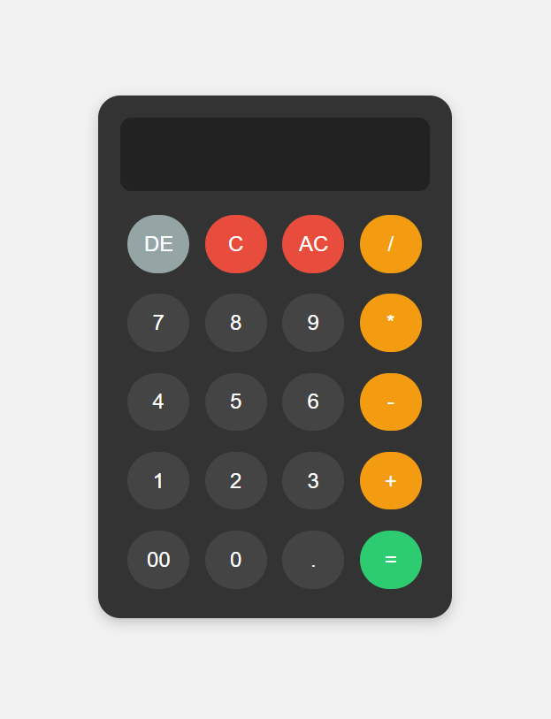

# Simple React Calculator

A simple, interactive calculator built using React. It supports basic arithmetic operations such as addition, subtraction, multiplication, and division, along with features like clear, delete, and error handling.

## Features
- Supports basic arithmetic operations (`+`, `-`, `*`, `/`)
- Clear and delete buttons for easy input management
- Error handling (e.g., prevents division by zero and invalid expressions)
- Responsive design for desktop and mobile use

## Technologies Used
- React
- JavaScript (ES6+)
- HTML5
- CSS3 (for styling)

## Installation

To run this project locally, follow these steps:

1. Clone the repository:
   ```bash
   git clone https://github.com/MBashov/Simple-Calculator.git

2. Navigate into the project directory:
    ```bash
    cd Simple-Calculator

3. Install dependencies:
    ```bash
    npm install

4. Start the development server:
    ```bash
    npm start

5. Visit http://localhost:5173 in your browser to view the calculator.

## Usage
- Enter numbers using the buttons.
- Perform basic arithmetic operations (+, -, *, /).
- Use the AC button to clear the display.
- Use the DE button to delete the last entered character.
- Press = to calculate the result.

## Screenshots
